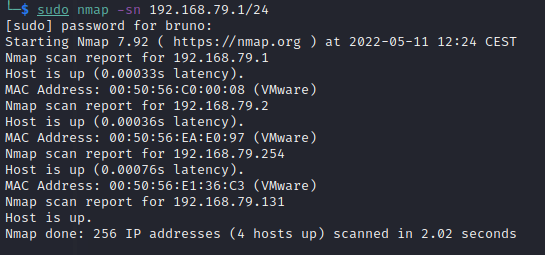
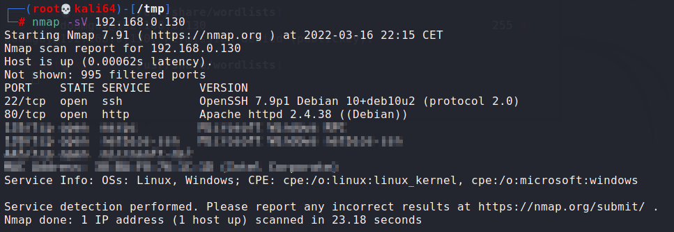

# Reconnaissance

The first step of an attack is the Reconnaissance phase. It consists of techniques used by the attacker to actively or passively gather information that can be used to support targeting. Such information may include details of the victim organization, infrastructure, or staff/personnel. This information can be leveraged by the attacker to aid in other phases of the attack, such as using gathered information to plan and execute Initial Access, to scope and prioritize post-compromise objectives, or to drive and lead further Reconnaissance efforts. This encompasses technical as well as nontechnical information. Technical information may be IP-ranges, insight into the internal network infrastructure, used hardware and even passwords. But nontechnical information can also prove to be interesting in the context of a pentest, like social structures and location information. When used in combination, this information is often very helpful. For some accounts only certain type of information might be accessible, this will prove essential in later stages of the attack such as privilege escalation and also knowledge about the internal structures may therefore help focusing on the right targets.

The Reconnaissance phase is usually one of the most time-consuming stages of the attack and the information gathered, and well documented, in this phase is crucial for a successful lifecycle of the attack. Information gathered in publicly available sources are referred to as "passive reconnaissance" due to the less intrusive nature of these techniques, some also refer to this as OSINT (open-source intelligence). Examples for information sources are search engines, social networks, WHOIS databases or the Domain Name System (DNS). Active reconnaissance, on the other hand, collect information by sending requests directly to the target and analyzing the responses and how the target reacts to these requests, using tools such as nmap.

## Host Discovery

An attacker sends a probe to an IP address to determine if the host is alive. Host discovery is one of the earliest phases of network reconnaissance. The adversary usually starts with a range of IP addresses belonging to a target network and uses various methods to determine if a host is present at that IP address. Host discovery is usually referred to as 'Ping' scanning using a sonar analogy. The goal is to send a packet through to the IP address and solicit a response from the host. As such, a 'ping' can be virtually any crafted packet whatsoever, provided the adversary can identify a functional host based on its response. An attack of this nature is usually carried out with a 'ping sweep,' where a particular kind of ping is sent to a range of IP addresses.

There are many ways to perform a ping sweep, for a basic ping sweep with nmap, you can use the option -sn:

```
nmap -sn <network>/<cidr>
```


Running this command with sudo will add additional ping functionality such as ARP to find the MAC addresses of discovered hosts:



The basic host discovery method showed above might be good for internal networks, however, this method will be inneficient in other scenarios. The explanation of other methods for host discovery is out of the scope of this explanation as there are numerous other ways to accomplish this with nmap alone. Once our live host is identified we are ready to move to the next step.

## Port Scanning

Although common services have assigned port numbers, services and applications can run on arbitrary ports. Additionally, port scanning is complicated by the potential for any machine to have up to 65535 possible UDP or TCP services. The goal of port scanning is often broader than identifying open ports, but also give the adversary information concerning the firewall configuration.

Depending upon the method of scanning that is used, the process can be stealthy or more obtrusive, the latter being more easily detectable due to the volume of packets involved, anomalous packet traits, or system logging. Typical port scanning activity involves sending probes to a range of ports and observing the responses. There are four port statuses that this type of attack aims to identify: open, closed, filtered, and unfiltered. For strategic purposes it is useful for an adversary to distinguish between an open port that is protected by a filter vs. a closed port that is not protected by a filter. Making these fine grained distinctions is requires certain scan types. Collecting this type of information tells the adversary which ports can be attacked directly, which must be attacked with filter evasion techniques like fragmentation, source port scans, and which ports are unprotected (i.e. not firewalled) but aren't hosting a network service. An adversary often combines various techniques in order to gain a more complete picture of the firewall filtering mechanisms in place for a host.

The most popular linux tool for port-scanning is nmap, which have the ability to send TCP, UDP or ICMP packets to determine if a port is open based on the host's response. Nmap also has other capabilities such as OS decetion, service and version detection and doing DNS queries and subdomain search only to name a few. Nmap -help can give you a simple overview on how powerful this tool can be and the different ways you could use it. For example we could use -sT for a TCP connect port scan or take a less intrusive approach with -sS for a TCP SYN port scan.

```
nmap -sS <ip>
```

Let's see an example from one of our labs:


From this simple scan we can learn a lot about our host, we can see, for example, ftp and mysql services running on open ports. This information can be used during the exploitation phase.

Another important part of the port scanning process is understanding firewall rules implemented and try to identify possible misconfigurations in firewall that would allow the attacker ways to bypass it. There are Nmap options such as -SF (FIN) and -sX (XMAS) that will send packets with only certain flags set to test if the firewall is responding accordingly. Even more problematic, identifying the lack of a firewall represents an open door to the attacker for easy access to the network.

## Service fingerprinting

Most commonly, fingerprinting is done to determine operating system and application versions. Fingerprinting by itself is not usually detrimental to the target. However, the information gathered through fingerprinting often enables the attacker to discover existing weaknesses and vulnerabilities in the target. For example, if the target is running a vulnerable version of a software application, the fingerprinting process can reveal the vulnerability. Fingerprinting can be done passively as well as actively.

Active fingerprinting involves sending TCP or ICMP packets and analyzing the response from the target, the packet headers contain information that causes different operating systems to respond differently. The attacker should be aware that active fingerpring brings the risk of easy detection.

To avoid detection, an attacker can rely on passive fingerprinting techniques that are stealthy and do not involve sending any packets to the target system, instead they rely on scanning the network to detect patterns in the usual network traffic, since different systems have different TCP/IP implementations. If your target is running publicly available services, passive fingerprinting may be a good way to start off your fingerprinting. Drawbacks of passive fingerprinting are that it is usually less accurate than a targeted active fingerprinting session and it relies on an existing traffic stream to which you have access. It can also take much longer depending on how high the activity level of the target system is.

One of the other most used features of Nmap is remote OS detection, there are different ways you can accomplish this. The -O option enables simple OS detection. Alternatively, Nmap also has a feature called the Nmap Scripting Engine(NSE), using the option -A will not only find the OS type but also run NSE scripts for version detection. Aditionally, using the options -sV and -sC the attacker can find the version of the service running on that port and also based on default NSE scripts any possible vulnerabilities regarding those services.

```
nmap -sV <ip>
```

Let's check another example from one of our labs:



We can see the version of the services running on port 22 and 80. This gives us crucial information about the services running on the host. We can then check if the services running on those particular versions are vulnerable to known vulnerabilities. This information might be crucial for the exploitation phase.
